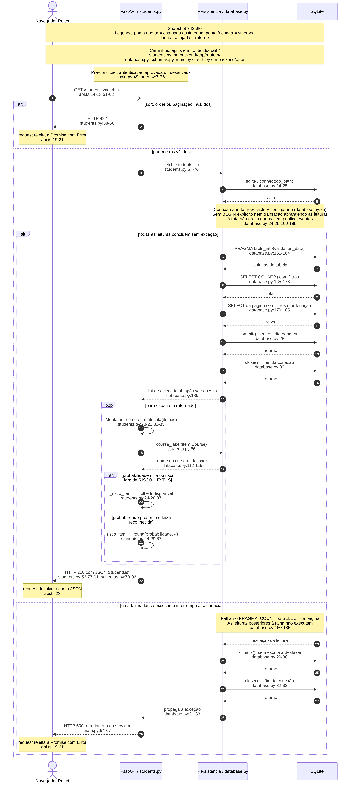

# Avaliação de Grau 1: listagem de alunos e risco

## Issue analisada

Issue [#3, endpoint de listagem de alunos e risco](https://github.com/BitStudioLabs/mais-alunos/issues/3), atribuída a Weversson e fechada em 28/08/2026, vinculada à história [#1, Listagem Preditiva de Alunos](https://github.com/BitStudioLabs/mais-alunos/issues/1). O recorte desta defesa é o endpoint `GET /students`: ele atravessa a camada de API, em `backend/app/routers/students.py:52-91`, e a camada de persistência, que consulta SQLite em `backend/app/database.py:127-186`. Portanto, a implementação atinge duas camadas, mesmo sendo uma operação de leitura.

A implementação inicial consta no commit [a53716069b83d36b5f2248cbfe4510d610c55724](https://github.com/BitStudioLabs/mais-alunos/commit/a53716069b83d36b5f2248cbfe4510d610c55724), de 28/08/2026, com autor `Weversson <weverssonlucas@rede.ulbra.br>`. Esse commit está incorporado nas branches `main` e `unstable`. O [histórico de eventos da issue](https://api.github.com/repos/BitStudioLabs/mais-alunos/issues/3/events) registra o fechamento sem vínculo com um commit (`commit_id: null`); não foi localizado um pull request diretamente associado. Assim, há evidência de autoria, fechamento e incorporação do código, mas não de um merge de PR específico associado à issue.

Todos os diagramas e números de linha desta defesa representam o código **as-built no commit imutável [342f9fee04f4063566001d3dfcc22e7d69ede6d6](https://github.com/BitStudioLabs/mais-alunos/tree/342f9fee04f4063566001d3dfcc22e7d69ede6d6)**, posterior à implementação inicial. A branch `unstable` identifica a origem desse recorte; mudanças posteriores da branch não alteram o código analisado aqui. Os commits da matriz pertencem ao projeto +Alunos; os commits deste repositório registram os artefatos da avaliação.

Os requisitos vêm do [PRD nesse mesmo commit](https://github.com/BitStudioLabs/mais-alunos/blob/342f9fee04f4063566001d3dfcc22e7d69ede6d6/PRD.md#L27-L57), e os critérios da história #1 estão em [USER_STORIES.md:11-19](https://github.com/BitStudioLabs/mais-alunos/blob/342f9fee04f4063566001d3dfcc22e7d69ede6d6/USER_STORIES.md#L11-L19). A tabela e as cores do front-end são tarefas distintas da história, citadas como contexto de integração. As evoluções posteriores ao fechamento, especialmente RN02 e o realce da linha crítica, são identificadas pelo commit [368f910c0be10bccf2627394bdea1d0c28110ed2](https://github.com/BitStudioLabs/mais-alunos/commit/368f910c0be10bccf2627394bdea1d0c28110ed2), de 04/09/2026, também de Weversson.

## Questão 1: rastreabilidade

Os critérios de RF03–RF06 e RN02 são recortes da história #1. Para RF07–RF11 e RNF01, a coluna de aceite explicita o comportamento verificável descrito no PRD. A cobertura abaixo resulta da leitura dos testes existentes no recorte analisado; não representa uma afirmação de execução pessoal de cada teste.

| Requisito | Critério de aceite aplicado ao recorte | Classe ou método | Teste e limite da cobertura | Commit de implementação |
|---|---|---|---|---|
| RF03 — listagem (`PRD.md:33`) | Havendo alunos processados, disponibilizar a listagem à tabela (`USER_STORIES.md:11`). | `list_students`, `backend/app/routers/students.py:52-91`; `fetch_students`, `backend/app/database.py:127-186`; `StudentList`, `backend/app/schemas.py:88-92`. | `test_students_list_default`, `backend/tests/test_api.py:119-126`: verifica total positivo e 20 itens da primeira página; não verifica toda a base. | [a537160](https://github.com/BitStudioLabs/mais-alunos/commit/a53716069b83d36b5f2248cbfe4510d610c55724) |
| RF04 — identificação (`PRD.md:34`) | Retornar nome e matrícula de cada aluno (`USER_STORIES.md:11`). | `_matricula` e `list_students`, `backend/app/routers/students.py:20-21,83-85`; `StudentListItem`, `backend/app/schemas.py:79-85`. | `test_students_list_default`, `backend/tests/test_api.py:123-126`: verifica campos, nome não vazio e fórmula da matrícula do primeiro item. | `a537160` |
| RF05 — probabilidade (`PRD.md:35`) | Disponibilizar probabilidade calculada no back-end para exibição percentual (`USER_STORIES.md:11`). | `train`, `backend/scripts/train_model.py:56-65`; `list_students`, `backend/app/routers/students.py:81-89`; conversão visual em `frontend/src/lib/constants.ts:100-102`. | `test_students_list_default`, `backend/tests/test_api.py:124`, verifica a presença do campo; não verifica valor calculado, intervalo de 0 a 1 nem conversão visual. Cobertura parcial. | `a537160` |
| RNF01 — processamento no back-end (`PRD.md:47`) | Processar/inferir no servidor e entregar dados prontos pela API. | `train` e `save_validation_db`, `backend/scripts/train_model.py:45-88`; leitura em `backend/app/database.py:176-185`. | `test_students_list_default`, `backend/tests/test_api.py:119-126`, verifica a resposta da API; não verifica a cadeia treino → banco → listagem. Arquitetura atendida, cobertura parcial. | `a537160` |
| RF07 — ordenação por probabilidade (`PRD.md:37`) | Aceitar ordenação crescente e decrescente por probabilidade. | `list_students`, `backend/app/routers/students.py:58-66`; `fetch_students`, `backend/app/database.py:137-140,158`. | `test_students_sort_probabilidade_desc`, `backend/tests/test_api.py:164-168`: cobre somente o sentido decrescente na API, sem clique no cabeçalho. | `a537160` |
| RF08 — ordenação por nome (`PRD.md:38`) | Aceitar ordenação A–Z e Z–A por nome. | `fetch_students`, `backend/app/database.py:11,137-140,158`. | Não há teste específico de ordenação por nome em `backend/tests/test_api.py`; o teste de probabilidade não cobre esse critério. | `a537160` |
| RF09 — filtro de risco (`PRD.md:39`) | Ao selecionar uma faixa, retornar somente alunos daquela faixa. | `fetch_students`, `backend/app/database.py:146-151`. | `test_students_filter_by_risco`, `backend/tests/test_api.py:143-146`: verifica a faixa Alto na API. | `a537160` |
| RF10 — busca por nome (`PRD.md:40`) | Buscar pelo nome ou parte dele e retornar lista vazia sem correspondências. | `fetch_students`, `backend/app/database.py:143-145`. | `test_students_search_by_name`, `backend/tests/test_api.py:129-134`, e `test_students_search_no_results`, linhas 137-140. | `a537160` |
| RF11 — paginação (`PRD.md:41`) | Limitar itens por página e usar `offset` para acessar os registros seguintes. | `list_students`, `backend/app/routers/students.py:60-61,67-76`; `fetch_students`, `backend/app/database.py:179-185`. | `test_students_list_default`, `backend/tests/test_api.py:119-126`, cobre só `limit=20, offset=0`. **Quebra:** falta teste de avanço de página/offset em `/students`. | `a537160` |
| RN02 — registros incompletos (`PRD.md:56`) | Manter o aluno na lista e sinalizar risco indisponível (`USER_STORIES.md:13`). | `fetch_students`, `backend/app/database.py:179-185`; `_risco_item`, `backend/app/routers/students.py:24-29`. | `test_students_anomalous_rows_not_omitted`, `backend/tests/test_api.py:280-291`; `test_students_filter_risco_indisponivel`, linhas 294-302; `test_risco_item_maps_inconclusive_to_indisponivel`, linhas 305-319. Cobrem funções com banco temporário/valores de entrada, sem fluxo HTTP completo ou renderização. | [368f910](https://github.com/BitStudioLabs/mais-alunos/commit/368f910c0be10bccf2627394bdea1d0c28110ed2), evolução posterior |
| RF06 — alerta visual, contexto da história (`PRD.md:36`) | A linha crítica apresenta alerta visual (`USER_STORIES.md:12`). | Condição e classe da linha em `frontend/src/components/StudentsTable.tsx:306,308-314`. | Não foi localizado teste de renderização desse comportamento. `test_students_filter_by_risco`, `backend/tests/test_api.py:143-146`, testa dados retornados pela API. | `368f910`, evolução posterior no front-end |

### Análise da quebra

A quebra principal está em **RF11 → avanço de página → `fetch_students` → teste ausente**. O SQL recebe `LIMIT ? OFFSET ?` em `backend/app/database.py:182-184`, porém `test_students_list_default` usa somente `offset=0` (`backend/tests/test_api.py:119-126`). O teste `test_list_validations_paginated`, linhas 61-66, usa `/validations` e não valida a paginação de `/students`.

Classifico essa ausência como **débito técnico de cobertura aceitável temporariamente no protótipo da disciplina**, pois o comportamento está implementado no SQL e a lacuna, por si só, não demonstra uma falha funcional. O risco é uma regressão repetir ou pular alunos ao trocar de página sem ser detectada pela suíte. A mitigação proposta é verificar duas páginas consecutivas de uma base fixa e acrescentar um teste que compare seus IDs, o tamanho das páginas e o total, incluindo um `offset` além do último registro. Essa verificação é uma ação pendente, não uma execução já realizada. Para uso institucional, priorizaria quitar essa dívida, porque a omissão de alunos prejudicaria a análise de risco.

Há também cobertura parcial de RF05, RF07 e RF08, explicitada na matriz, e a ausência de teste do alerta visual RF06. A evolução RN02 e o realce da linha crítica pertencem ao commit `368f910`, de 04/09/2026, posterior ao fechamento da issue em 28/08/2026. A defesa os descreve porque existem no snapshot analisado, sem atribuí-los à entrega inicial `a537160`.

## Questão 2: classificação dos requisitos

| Tipo | Requisito | Classificação no snapshot analisado |
|---|---|---|
| Funcional | RF03: listar alunos processados (`PRD.md:33`) | A API lista os registros de `validation_data`. O treino separa 20% do dataset para teste e grava somente essa amostra; a listagem não corresponde a todo o dataset nem a um cadastro institucional completo. Evidência: `backend/scripts/train_model.py:45-47,69-88`; `backend/app/database.py:176-185`. |
| Funcional | RF04: nome e matrícula (`PRD.md:34`) | Campos presentes no contrato `StudentListItem` e montados pela rota. Os nomes são sintéticos (`backend/scripts/populate_names.py:148-157,168`) e a matrícula é calculada por `20240000 + id` (`backend/app/routers/students.py:17-21,83-85`). |
| Funcional | RF05: percentual de risco (`PRD.md:35`) | A API devolve a probabilidade previamente calculada; a integração visual a multiplica por 100 e exibe uma casa decimal. Há arredondamento, e o teste da listagem verifica apenas a presença do campo. Evidência: `backend/scripts/train_model.py:56-65`; `backend/app/routers/students.py:24-29,87`; `frontend/src/lib/constants.ts:100-102`; `test_students_list_default`. |
| Funcional | RF06: alerta visual (`PRD.md:36`) | Contexto de integração: a tabela realça linhas de risco Alto/Muito alto em `frontend/src/components/StudentsTable.tsx:306,308-314`. Essa evolução do front-end, em `368f910`, não tem teste de renderização identificado. |
| Funcional | RF07 e RF08: ordenar probabilidade e nome (`PRD.md:37-38`) | Suportados pela API em ambos os sentidos. A tabela habilita essas colunas e liga o clique à ordenação. Cobertura automatizada somente para probabilidade decrescente. Evidência: `backend/app/database.py:11,137-140,158`; `frontend/src/components/StudentsTable.tsx:52-56,68-80,147-156,274`; `test_students_sort_probabilidade_desc`. |
| Funcional | RF09 e RF10: filtro de risco e busca por nome (`PRD.md:39-40`) | Implementados na consulta SQL, com os limites dos testes descritos na matriz. Evidência: `backend/app/database.py:143-151`; `test_students_filter_by_risco`, `test_students_search_by_name` e `test_students_search_no_results`. |
| Funcional | RF11: paginação (`PRD.md:41`) | Implementada na API com `limit` e `offset`; falta cobertura do avanço entre páginas. Evidência: `backend/app/routers/students.py:60-61,67-76`; `backend/app/database.py:179-185`; `test_students_list_default`. |
| Regra de negócio | RN01: resposta probabilística (`PRD.md:55`) | No recorte da listagem, a resposta contém probabilidade/faixa de risco e não expõe os rótulos binários de validação do modelo. Evidência: `backend/app/routers/students.py:77-91`; `backend/app/schemas.py:79-92`. |
| Regra de negócio | RN02: manter aluno com risco indisponível (`PRD.md:56`) | Evolução posterior ao fechamento: mantém registros persistidos com dados de risco ausentes e normaliza risco desconhecido para Indisponível. Evidência: `backend/app/routers/students.py:24-29`; `backend/tests/test_api.py:280-319`. Esses testes não comprovam ingestão de todo tipo de dado anômalo nem a apresentação visual. |
| Não funcional | RNF01: processamento e inferência no back-end (`PRD.md:47`) | Atendido arquiteturalmente: o treino calcula/persiste as probabilidades, e a API as entrega prontas. O requisito não exige inferência a cada requisição. Evidência: `backend/scripts/train_model.py:45-88`; `backend/app/database.py:176-185`. |
| Não funcional | RNF02: fonte de dados (`PRD.md:48`) | O treino lê `backend/dataset.csv`, definido em `backend/app/config.py:10`, por `load_dataset` em `backend/scripts/train_model.py:16-19`. Há evidência da fonte configurada; não há teste citado que comprove sua procedência/exclusividade. Os nomes sintéticos são enriquecimento demonstrativo, conforme `backend/scripts/populate_names.py:148-157,168`. |
| Não funcional | RNF03: framework componentizado (`PRD.md:49`) | Contexto de integração: front-end React em `frontend/src/main.tsx:1-9`, com consumo da API por `frontend/src/lib/api.ts:14-23,51-63`. Não é uma implementação própria do endpoint da issue #3. |
| Não funcional | RNF04: resposta abaixo de 2 segundos (`PRD.md:50`) | **Não comprovado**: os testes citados de busca/filtro/ordenação (`backend/tests/test_api.py:129-168`) verificam resultados, sem medir tempo de resposta da interface. |
| Não funcional | RNF05: desktop a partir de 1366×768 (`PRD.md:51`) | **Não comprovado**: o componente mede o espaço disponível em `frontend/src/components/StudentsTable.tsx:103-118`, mas isso não demonstra validação nessa resolução. Não foi localizado teste de viewport correspondente. |

## Questão 3: sequência e transação

Fonte versionada: [`sequencia.mmd`](sequencia.mmd). [Abrir o PNG em tamanho completo](sequencia.png). A imagem foi exportada diretamente dessa fonte com Mermaid CLI; o comando de exportação está no [README do repositório](https://github.com/Weversson/G1_DevSistemas#exportar-o-diagrama).

### Recorte e notação

O desenho representa uma tentativa de `GET /students` iniciada pelo navegador. A função `fetchStudents` usa o cliente `request`, que obtém o token, chama `fetch` e aguarda a resposta (`frontend/src/lib/api.ts:14-23,51-63`). O envio usa `-)`, seta aberta para chamada assíncrona; as chamadas síncronas usam `->>` e os retornos usam `-->>`, conforme a [notação Mermaid](https://mermaid.js.org/syntax/sequenceDiagram.html#messages). O `await` aguarda o resultado da operação de rede; não representa publicação de evento. No servidor, `list_students` e `fetch_students` são funções síncronas (`backend/app/routers/students.py:53-76`; `backend/app/database.py:127-186`).

A pré-condição desenhada é **autenticação aprovada ou desativada**. A rota recebe `Depends(require_auth)` em `backend/app/main.py:49`; sem chaves configuradas, a dependência permite a chamada, e com credenciais exigidas e inválidas responde HTTP 401 (`backend/app/auth.py:7-35`). Nesse caso, `list_students` não executa. O diagrama começa na tentativa HTTP após obter o token e abstrai o cache e a repetição configurada no React Query (`frontend/src/lib/queries.ts:11-18,45-50`).

No diagrama, `api.ts` significa `frontend/src/lib/api.ts`; `students.py`, `backend/app/routers/students.py`; os demais arquivos Python indicados estão em `backend/app/`. A função Python `fetch_students` pertence à linha de vida de persistência, separada do SQLite que executa o SQL.

### Ordem das mensagens

1. **Mensagens 1–2:** o navegador solicita a listagem. Parâmetros inválidos de paginação, ordenação ou direção produzem HTTP 422 antes da consulta; `limit` e `offset` usam validação declarativa, e `sort`/`order` são verificados na função (`backend/app/routers/students.py:58-66`).
2. **Mensagens 3–11:** a rota chama `fetch_students`, que abre a conexão e configura `row_factory`. Executa, nessa ordem, `PRAGMA table_info`, contagem filtrada e consulta da página (`backend/app/routers/students.py:67-76`; `backend/app/database.py:24-25,160-185`). O `PRAGMA` verifica a presença da coluna `Course`, usada na projeção e no filtro de curso (`database.py:161-175`).
3. **Mensagens 12–16:** ao sair do `with`, o gerenciador chama `commit()` e depois `close()`. Só então a função converte as linhas em dicionários e retorna os itens e o total. O `return` está fora do `with` (`backend/app/database.py:27-33,160-186`).
4. **Mensagens 17–21:** para cada item, a rota monta identificação, calcula matrícula, traduz o curso e normaliza o risco. Probabilidade nula ou faixa desconhecida gera probabilidade `null` e risco `Indisponível`; no outro caminho, arredonda a probabilidade para quatro casas (`backend/app/routers/students.py:20-29,81-89`; `backend/app/database.py:112-119`).
5. **Mensagem 22:** a rota devolve a estrutura definida por `StudentList`; a resposta HTTP 200 contém o JSON, lido por `request` no navegador (`backend/app/routers/students.py:52,77-91`; `backend/app/schemas.py:79-92`; `frontend/src/lib/api.ts:23`).

### Onde começa e termina a transação?

**Não há uma transação explícita abrangendo esse fluxo.** A mensagem 4 abre uma conexão; as mensagens 14 e 26 encerram essa conexão no sucesso e na falha, respectivamente (`backend/app/database.py:24,33`). Esses limites estão marcados no diagrama como conexão, e não como `BEGIN`/`COMMIT` de uma operação de escrita.

O código usa `sqlite3.connect(db_path)` sem alterar o controle transacional (`backend/app/database.py:24`). No padrão do Python 3.12, `SELECT` não provoca o `BEGIN` implícito reservado a operações de escrita. Por isso, chamar `commit` ou `rollback` aqui não comprova uma transação única envolvendo contagem e página. [Documentação do sqlite3 no Python 3.12](https://docs.python.org/3.12/library/sqlite3.html#transaction-control-via-the-isolation-level-attribute).

O caminho da rota só consulta o banco (`backend/app/database.py:160-185`): não pode deixar um aluno gravado pela metade nem publicar um evento sem registro. Entretanto, **`total` e `items` podem refletir instantes diferentes** se outra conexão alterar a tabela entre as duas consultas. É uma possibilidade de inconsistência da resposta, não de gravação parcial; o código não garante um snapshot único nem faz compensação (`database.py:176-185`).

### Se a mensagem N falhar, qual é o estado?

| Mensagem/operação | Estado e tratamento implementado | Evidência no snapshot |
|---|---|---|
| Validação antes da mensagem 3 | HTTP 422; nenhuma conexão de consulta aberta. O cliente rejeita a Promise ao receber o erro. | `backend/app/routers/students.py:58-66`; `frontend/src/lib/api.ts:19-21`. |
| 4 — abrir a conexão | Se `sqlite3.connect` falhar, não há conexão retornada nem rollback executado por esse gerenciador: a abertura está antes do `try`. A exceção chega ao tratador HTTP 500. | `backend/app/database.py:24-26`; `backend/app/main.py:64-67`. |
| 6, 8 ou 10 — PRAGMA/leituras | A execução para na primeira exceção; consultas posteriores não acontecem. As mensagens 23–29 representam a exceção, a tentativa de rollback, o fechamento, a propagação e HTTP 500. Não há escrita a desfazer. | `backend/app/database.py:29-33,160-185`; `backend/app/main.py:64-67`. |
| 12 — commit | Se a chamada lançar exceção, o gerenciador tenta rollback e executa `close` no `finally`; não retorna itens. Mesmo nesse caso, a rota não havia efetuado escrita. | `backend/app/database.py:27-33,160-186`. |
| 17–21 ou validação da resposta | Se a montagem/validação falhar, a conexão já foi fechada; não há rollback dessa etapa nem resposta parcial enviada pelo código da rota. O tratador genérico produz HTTP 500. | `backend/app/database.py:186`; `backend/app/routers/students.py:52,77-91`; `backend/app/main.py:64-67`. |
| Recebimento HTTP ou leitura do JSON no navegador | A Promise pode ser rejeitada mesmo após o servidor concluir as leituras. Não há compensação de dados, porque o endpoint não escreve. Para respostas HTTP de erro, `request` lança `Error`. | `frontend/src/lib/api.ts:18-23`; `backend/app/database.py:160-185`. |

O ramo `Indisponível` da mensagem 20 é uma resposta normal, não uma falha da solicitação. Ele trata probabilidade nula ou faixa não reconhecida; não valida todo tipo de anomalia numérica (`backend/app/routers/students.py:24-29`; `test_risco_item_maps_inconclusive_to_indisponivel`).

Declaração de uso de IA: utilizei inteligência artificial como apoio para localizar e conferir evidências, revisar as respostas e corrigir o diagrama. A cobertura descrita foi conferida pela leitura do código e dos testes no commit indicado; a suíte da aplicação não foi executada novamente nesta revisão. A imagem foi gerada a partir da fonte Mermaid versionada.
